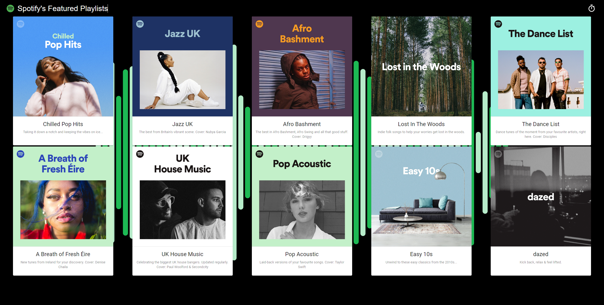
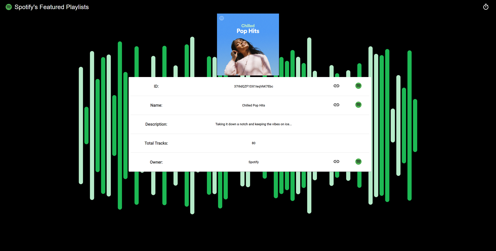

# Spotify Featured Playlists - React

The focus behind this web application is to create an application that will be eventually updated daily to provide the featured playlists within Great Britain. The application shows details about the playlists (e.g. ID, Author) and directs the user to Spotify's website and app, this will allow them to add listen or follow the playlist. On the top right side of the web page, there is a Timer icon that allows the user to see how long they have been on the website.

## Editors
* Martyn Fitzgerald

## Software Used    

* Node.js (12.16.3)
* Visual Studio Code

## Resources Used

* Spodify API, is used for to receive the information stored as a local JSON file (https://developer.spotify.com/console/get-featured-playlists/).

## Setup Environment

* Install Node.js (https://nodejs.org/en/).

## Installation

1. Un-zip Spotify-Featured-Playlists.zip file.
2. Open Command Prompt.
3. Move into the folder of the repository.
```bash
cd Spotify-Featured-Playlists
```
4. Install all dependencies.
```bash
npm install
```
5. Start the node.js environment.
```bash
npm start
```
6. Open http://localhost:3000
## Images Of Project

<div>
  
  
</div>